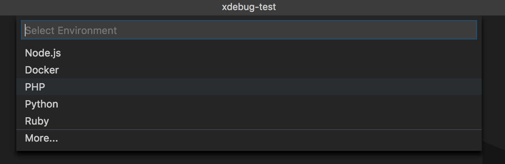
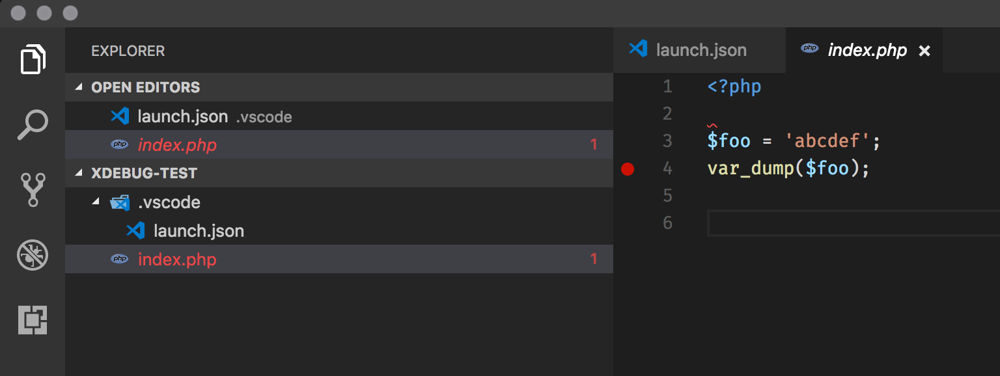
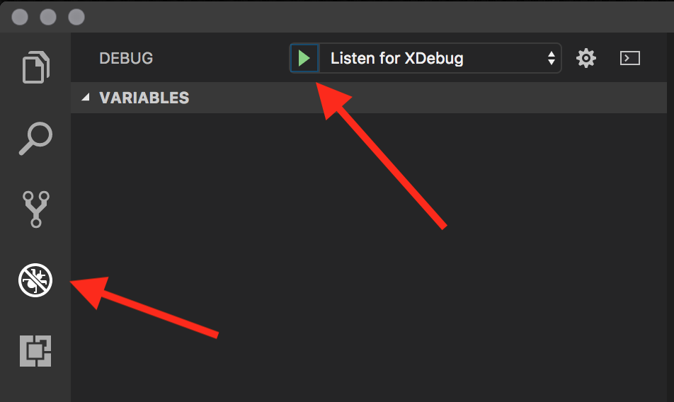
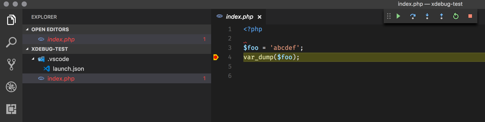
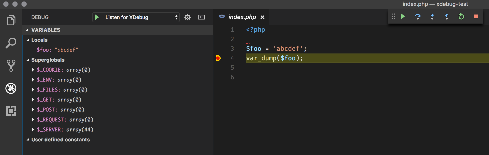

# Configuring VS Code

## Configuration

In VS Code, go to 

`Debug > Add Configuration...`

. If it asks, create a new PHP configuration.



VS Code will generate a boilerplate file at `.vscode/launch.json`. One of these configuration entries will be labeled `Listen for XDebug`. The default values are fine here, but you'll need to add a line so that the configuration looks like this:

```text
{
  "name": "Listen for XDebug",
  "type": "php",
  "request": "launch",
  "port": 9000,
  "pathMappings": {
    "/var/www/[your docroot here]": "${workspaceRoot}"
  }
}
```

Note that you will need to change the key of your `pathMappings` object to match the folder in `/var/www` that is running the site. Also, if you have mapped a subfolder of the repository as your guest docroot \(ie. you set your Vagrant config to load `/path/to/repo/docroot` on your host as `/var/www/remote` on your guest\) you will need to set the value of the `pathMappings` object to `${workspaceRoot}/docroot`.

## Debugging Code

Before debugging, you need to set breakpoints in your code. Consider this sample PHP file:



The red dot on line 4 indicates that XDebug will stop before processing that line of code.

To begin debugging, click the Debugging icon on the sidebar, select Listen for XDebug in the dropdown, and press the green arrow.



This will begin your debugging session. Load your website in a browser. When the breakpoint is hit, you will be taken back into VS Code, where the line that you set the breakpoint will be highlighted:



If you hover over the 

`$foo`

 variable in line 3, you'll see the contents of that variable. Additionally, you can see all the local variables in the call stack in the sidebar using the debugging area:



## Conclusion

This is a simple example of debugging a PHP script using XDebug and VS Code, but you can debug far more complex framework applications in the same way. Keeping track of the call stack and the contents of various objects without having to pepper `var_dump()` statements throughout your code is a quick way of tracking down bugs.

